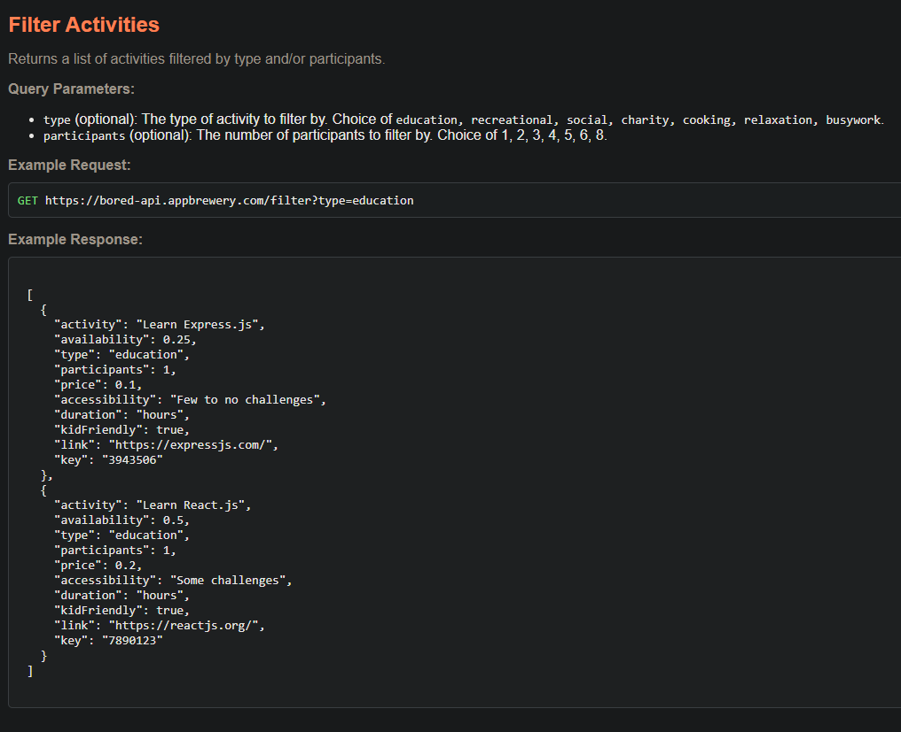
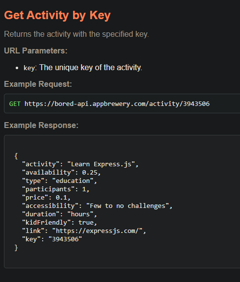
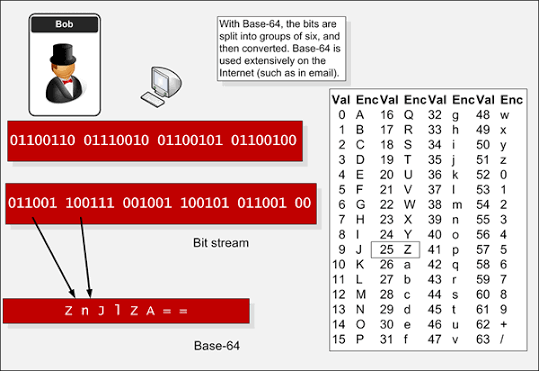
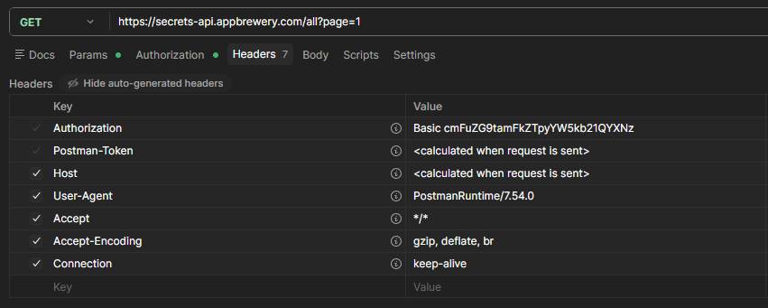
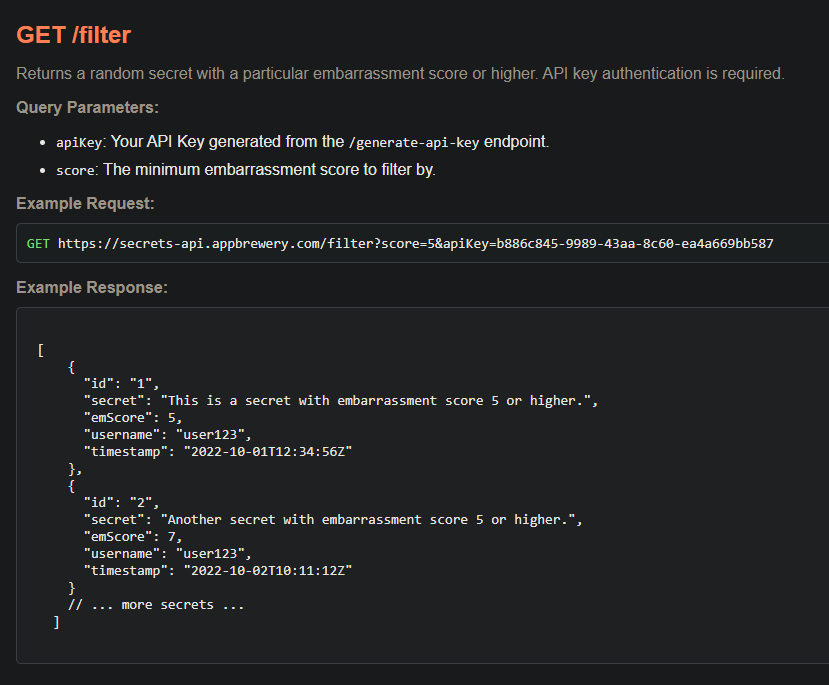
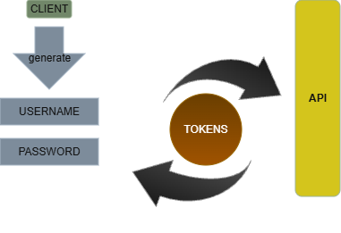

# INTRODUCTION TO API

## Using Application Programming Interface (API)

When theres 2 Programs with different language,
API acts as the bridge so they know how to interact to each other.

_Example:_

You want a note website that auto captures what weather it is that day.

and there is an open sourced WeatherProgram that stores weather data.
the WeatherProgram will create an API that tells you how to interact with their services.

Now what you need is to make request from your website through API,
and using the API you can now know how to interaact with their services
to get what you requested for and apply to your website.

---

```
         (GET REQUEST)
Your website ------------> API -----------------> WeatherProgram
Your website <------------ API <----------------- WeatherProgram
         (RESPONSE/DATA)
```

---

_So basically API is a set of rules that you can follow._

**Types of API:**

- `GraphQL`
- `{REST:API}`
- `{SOAP}`
- `gRPC`
- _etc._

These are architectural styles. And these have different set or rules on how to interact with the website.

**RESTful API** is the most popular and most used API in the web development.

You use **HTTP Protocol** to interact with the API.
so its using `GET`, `POST`, `PUT`, `PATCH`, `DELETE`.

## API FORMATTING STRUCTURE

Endpoints, Path Parameters, and Query Parameters.

```
Frontend -----(GET REQUEST)-----> Your server
```

This is same thing as API, called "Private API"
So this is basically the structure

```
---------------------------(GET REQUEST)------------->>>
```

```
<<<------------------------(RESPONSE)----------------------------
```

**Private API**: Something you dont want documented or not something that can be shared.
**Public API**: Something that is open for the public use.

## API ENDPOINTS

`baseurl/Endpoint`

the endpoint is the route on the API Provider Server.

### Query Parameter

`baseURL/endpoint + ?query=value`

You start all query with a question mark then value of it.

Normally you hit API for filtering, searching, sorting.
you can also do multiple query via &

`baseURL/endpoint?query=value&query2=value`

#### `req.query` (server-side)

When a URL has a `?` followed by key=value pairs, those are query parameters. Express automatically reads them and puts them inside `req.query`.

```js
app.get("/filter", (req, res) => {
  console.log(req.query.type);
});

// If user visits: /filter?type=Puns&limit=5
// req.query.type = "Puns"
// req.query.limit = "5"
```

You dont need to define anything special in the route — no colons, no placeholders. Express just automatically grabs everything after the `?` for you.

---

**so for this Practice API documentation:**
*https://bored-api.appbrewery.com/*



_In the API response you can see the type and their value._
_and on top you can see the query parameters you can use to control what you wanna do._

---

so for example:
GET *https://bored-api.appbrewery.com/filter?type=education&participants=1;*

on the image above the one who will show up is those who have education type and 1 participants.

### Path Parameter

`baseURL/endpoint/{path-parameter}`

endpoint is a **fixed** path and cannot change.
but path-parameter is the path that **does change**.
it could be an _id_, or _username_.

so its something very specific that can help identify any resource on the API.

#### `req.params` (server-side)

When you define a route with a colon like `/jokes/:id`, that `:id` becomes a placeholder. Whatever the user puts there, Express captures it and stores it inside `req.params`.

```js
app.get("/jokes/:id", (req, res) => {
  console.log(req.params.id);
});

// If user visits: /jokes/5
// req.params.id = "5"
```

The name after the colon is the key. `:id` means `req.params.id`. If you wrote `:name` it would be `req.params.name`. You pick the name, basically you are setting a variable on the URL that can be accessed through req.params.variable

#### `parseInt()` for URL values

Everything that comes from a URL is a **string**. Even if the user types `/jokes/5`, `req.params.id` is `"5"` (a string), not `5` (a number).

This matters because `===` checks both value AND type:
```js
"5" === 5   // false — string vs number, different type
5 === 5     // true
```

So if your jokes array has `{ id: 5 }` (number) and you compare with `"5"` (string), it will never match. `parseInt()` converts the string to a number:
```js
parseInt("5")  // returns 5 (now its a number)
```

and if you cant convert it, you can just use == for loose control, but if you need full control === is the way to go.

So to differentiate,

**Query Parameter** is for _filtering and searching_ while **Path Parameter** is for _identifying a resource_ by some specific parameter.

- `req.params` = comes from the URL path (`/jokes/:id` → `/jokes/5`)
- `req.query` = comes from the `?` part (`/filter?type=Science`)

Example:


GET *https://bored-api.appbrewery.com/activity/5914292*

Since i each key is unique then i want to access the activity with the key of 5914292.


---


## INTRODUCTION TO JSON

### JSON - Javascript Object Notation

Its a way to format data that can be sent over the internet in a readable and efficient way.

Its structure *very similar to JS Object*.

**Javascript Object**
```js
const servant = {
  name: "Lau",
  age: 18,
  city: "Pasay",
  education: [
    {
      degree: "Criminology",
      university: "Philippine National Police Academy",
    },
    {
      degree: "BS Aeronautics",
      university: "Philippine National Aeronautics State University",
    },
  ],
};
```
*This is an object, Its a structured template for repeating data. And in here you can nest an object inside another object.*

**JSON**

```json
{
  "name": "Jade Japos",
  "age": 18,
  "city": "Valenzuela",
  "education": [
    {
      "degree": "B.S. Information Technology",
      "school": "Pamantasang Lungsod ng Valenzuela"
    },
    {
      "degree": "B.S. Computer Science",
      "school": "University of the Philippines"
    }
  ]
}
```
*This is the way to structure a JSON.*

**Difference:**

The changes is that the Javascript keys (example: name) has turned into a string.
Every keys is a **string** and the value can be **string**, **numbers**, **array**, **boolean**, **null**, or **nested objects**.

When you encounter **JSON** its because some *data are being transferred* across internet.
**Javascript Object** has a more relax notation because *it can be interpreted by the editor or by the code interpreter themselves*.

#### Reason why JSON is used:

Its because it makes it easier to transfer data by compressing it.

This is JS Object and this is JSON

```js
// JS Object
const wardrobe = {
  doors: 2,
  drawers: 2,
  color: "red",
};

// JSON (flat packed)
{"doors":2,"drawers": 2,"color":"red"}
```

then when JSON is transferred to internet, it is expanded again in usable format like JS Object if it is needed.

Sometimes JSON is hard to read because it is sent in its flat pack notation, so use JSON Visualizer online.

*jsonviewer.stack.hu*


---

### JS Object ---> JSON (Serialization)

This is called **Serialization** — Turning an object into a JSON.

in order to turn them using code you would need the JSON module

`const jsonData = JSON.stringify(data);`

You paste the **Javascript object** on the `data`

### JSON ---> JS Object (Deserialization)

This is how you reverse the process of turning JSON back to JS Object

`const data = JSON.parse(jsonData);`

You paste the **JSON** on the `jsonData`.

*then you can now use the JSON on the ejs by calling it `<% array.category.division.name %>`*

---

## res.send vs res.render vs res.json

`res.send()` — Sends raw data directly to the browser. It can be a string, object, or HTML.
Its not just for files, you can send anything with it.

`res.render()` — Renders a template like EJS and passes data as JS objects to it.

`res.json()` — Takes whatever JS object or array you give it and converts it into JSON, then sends that JSON as the response.

```js
res.json({ name: "Jade", age: 18 });
// The browser/client receives: {"name":"Jade","age":18}
```

**How is `res.json()` different from `res.send()`?**
`res.send("hello")` can send anything — text, HTML, objects.
`res.json()` is specifically for sending JSON. It guarantees the output is always valid JSON and tells the browser "hey, this is JSON data" so the browser knows how to read it properly.

*If you are using a template like EJS, use `res.render`.
If you just want to display raw data on the browser, use `res.send`.
If you are building an API and need to return JSON data, use `res.json`.*

---

## SERVER-SIDE API REQUEST USING NATIVE NODE & EJS

### Making requests from your server using Node and Axios

What if we want to create an app where we need our server to make the API request?
This is one of the most common needs in node and express Backend.

This is basically what we are trying to do.

```
**REQUEST**------------------------------------------->
```

```
<------------------------------------------- **RESPONSE**
```

The code for this would be very long and complicated by using native node such as `https` module.

---

### OUR SERVER MAKING REQUEST TO API

```js
import https from "https";

app.get("/", (req, res) => {
  const options = {
    hostname: "bored-api.appbrewery.com",
    path: "/random",
    method: "GET",
  };

const req = https.request(options, (res) => {
  let data = '';
  res.on('data', (chunk) => {
    data += chunk;
  });

  res.on('end', () => {
    try {
      const result = JSON.parse(data);
      res.render("index.ejs", {activity : result})
    } catch (error) {
      console.error("Failed to parse response: ", error.message);
      res.status(500).send("Failed to fetch activity. Please try again.")
    }
  });
});

req.on('error', (error) => {
  console.error('Network Request Error:', error.message);
  res.status(500).send("Failed to fetch activity. Please try again.")
});

  req.end();

});
```
---

*Explanation:*

*We set the setting for the following:*
- **base URL** for where API is posted
- **The path** which is endpoint we are trying to access.
- **Method** for how we wanna interact with the API.

**Which is this:**


```js
app.get("/", (req, res) => {
  const options = {
    hostname: "bored-api.appbrewery.com",
    path: "/random",
    method: "GET",
  };
```

Now we will put that options into the request which will use `https.request`

**You put the options as input:**
```js
const req = https.request(options, (res) => {
  let data = '';
  res.on('data', (chunk) => {   //Pack from here
    data += chunk;              // to
  });                           // here
```
*Response is a callback* which is in a pack.

then *add each chunk* as a data string which was the
`(chunk) Input then data += chunk` = Which is adding each chunk as data string.

#### And once we receive the word "end" from our request
 **We can now use the data collected.**

```js
  res.on('end', () => {
    try {
      const result = JSON.parse(data);              //We first convert the data we got from the API into usable format.
      res.render("index.ejs", {activity : result})   //Now we can use that data we got into frontend or backend.
    } catch (error) {                             // Catch block so that if theres an error we can log the error.
      console.error("Failed to parse response: ", error.message);
      res.status(500).send("Failed to fetch activity. Please try again.")
    }
  });
});
```

### Next is the Error catching

```js
req.on('error', (error) => {  //If there was an error from request we have a callback to handle the error.
  console.error('Network Request Error:', error.message);
  res.status(500).send("Failed to fetch activity. Please try again.")
});
```

The last is ending the access portal.

`req.end(); });` — You end the API-request.

*This is usable **HOWEVER**, It is pretty long, unlike **AXIOS***


## AXIOS

`npm i axios` to install axios

**Axios** makes it easier and simplifies the code.

From that paragraph type of coding into this

```js
import axios from "axios";

app.get("/", async (req, res) => {
  try {                   //below, we use get axios."GET" method to make a request to API Endpoint
    const response = await axios.get("https://bored-api.appbrewery.com/random");
    res.render("index.ejs", {activity: response.data});
  }catch (error){
    console.error("Failed to make request: ", error.message);
    res.status(500).send("Failed to fetch activity. Please try again.");
  }
})
```
*It has been sliced noticeable short.*

### async/await is REQUIRED

Notice the `async` on the route callback and `await` on `axios.get()`.
Both are **required** when using Axios inside a route.

- Without `async` on the callback, using `await` will throw a **syntax error**.
- Without `await` on `axios.get()`, `response` will be a **Promise** not the actual response.
So `response.data` will be `undefined`.

*Always remember: `async` on the function, `await` on the axios call.*

---

### Why Axios is shorter than Native Node

1. **No manual JSON parsing** -- Axios automatically detects JSON responses and parses them into JS Objects for you. With native node you had to do `JSON.parse(data)` yourself.

2. **No chunk collecting** -- Native node sends data in pieces (chunks) that you have to collect manually. Axios handles all of that behind the scenes.

3. **Cleaner error handling** -- One try/catch instead of multiple `.on('error')` listeners.

### Axios Response Object

When you do `axios.get()`, it does **NOT** give you the raw JSON body directly.
Axios wraps everything in its own **response object**:

```js
{
  data: { activity: "...", type: "diy", ... },   // <- the actual JSON body lives here
  status: 200,
  statusText: "OK",
  headers: { ... },
  config: { ... },
}
```

So `response` is the **axios wrapper**, not your data.
That's why you need `response.data` to access the actual JSON body.

- `response.activity` -> **undefined** (axios wrapper has no `.activity`)
- `response.data.activity` -> **"Make a scrapbook..."** (correct)

You can store it in a variable to avoid writing `.data` every time:

```js
const result = response.data;
result.activity    // works
result.type        // works
```

### JSON.stringify for EJS Display

Even though Axios already parses JSON into a JS Object for you,
**EJS cannot display a JS Object as text**. It will show `[object Object]`.

So when passing data to `res.render` you need to convert it back to a readable string:

```js
res.render("index.ejs", { content: JSON.stringify(response.data) });
```

*Axios handles `JSON → JS Object` for you (no `JSON.parse` needed),
but displaying that object in EJS requires `JSON.stringify` to turn it back into a readable string.*


# API AUTHENTICATION

## Authenticating yourself with the API Provider.

This is the ability to prove that you have the rights to access their particular API.

Some people dont want to share their API
because **Resource or Data is valuable**.

## How to authenticate

How to authenticate the user or the client making the API request,
or if theyre authorized to make that request.

We can send them the data, or **not give them access**.

---

## TIERS OF AUTHENTICATION

| Tier | Name |
|------|------|
| **0** | No Authentication |
| **1** | Basic Authentication |
| **2** | API Key Authorization |
| **3** | Token Based Authentication |

### No Authentication

Api that you can access on your own. Everyone can use No Authentication API.
Since its free you must have safety measures such as **Rate Limit**.

For example:

Reference: *https://bored-api.appbrewery.com/*

In this API Documentation it has RateLimit to **100 Request/15 minutes**.
You can limit it by *checking each IP address*, how many request they are making per minute.

---
### Basic Authentication

In here you provide a *username* and *password* when making API Request.
So you are **authenticating yourself** to the provider.

Usual way to do Basic Authentication is by passing over a **Base64 encoded string** in the Header of the request.

But How?

So first you turn your characters into Binary


Which you can then turn into a Base64:

In here the binary word is **fred** which turned into **ZnJlZA==**


But what is it that we put on the header?

*its the account information.*
**Username:Password**

You will now add this into an **Authorization header**,
which you can pass the data along when you make a request.

One thing to take note is that with **Basic Authentication** you can view who is making alot of requests,
since they are required to pass their *username* for *access*.

Example of API documentation for testing authentication:
*http://secrets-api.appbrewery.com/*

#### POST /register
Registers a new user. If the username is already taken, it will return an error.

**Request Body:**
```
{
  "username": "The username of the new user.",
  "password": "The password of the new user."
}
```

**Example Request:**

**POST** *https://secrets-api.appbrewery.com/register*
```
{
  "username": "randomjade",
  "password": "randomPass"
}
```
**Example Response:**
```
{
  "success": "Successfully registered."
}
```
**Take note that if you are using Postman!!**
You will send the request in *Body* instead of **Authorization.**

**Authorization** will only work when accessing an endpoint that has basic authentication.
You will enter your account that you registered in it.

You can now access the route that needs Basic Authentication.

**GET** *https://secrets-api.appbrewery.com/all?page=1*

#### Authorization Generates a Header

Quick Note on the Authorization on Postman is that when putting a request with username and password,
Postman will **generate the header** which contains all of the things on "*Headers Image*"

Great thing about libraries like **Axios** is that it can *generate the header* by just providing username and password.

#### Basic Auth in Axios Code

This is how you do Basic Authentication with Axios.
You just pass an `auth` object as the second argument:

```js
const response = await axios.get(API_URL + "all?page=2", {
  auth: {
    username: "yourUsername",
    password: "yourPassword",
  },
});
```

*Axios will take care of encoding it to Base64 and putting it in the Authorization header for you.*

**If you were to check the "Headers"**

Next to Authorization is *Basic cmFuZG9tamFkZTpyYW5kb21QYXNz*
Which means Basic Authentication then your username:password in base64.

`cmFuZG9tamFkZTpyYW5kb21QYXNz` to `randomjade:randomPass`

*Headers Image*


---

### API Key Authorization

**API Key Authorization vs Authentication**

#### Authentication

if you have a user, they can **authenticate** themselves with your service.
Which means they are *logging in* or *registering*.

#### Authorization

It's simply a client who is allowed to use your service with an **API Key**
that might be associated with a user, in which case they are getting *authenticated*
themselves to get the API Key to **authorize** themselves to use their API.
or no need for getting authenticated If you got hold of the API Key and authorize yourself
with the API Provider.

Thats why alot of PublicAPI uses API Key, because its easier to track the usage per API Key.

**EXAMPLE OF API KEY USAGE**

**GET/generate-api-key** 
Generates a new API key.

**Example Request:**
```
GET https://secrets-api.appbrewery.com/generate-api-key
```
**Example Response:**
```
{
  "apiKey": "generated-api-key"
}
```
*API-Docs: https://secrets-api.appbrewery.com/*

Now that you got the key lets look at how to use it.

In here we will use the filter route which requires the API Key as *query-parameter*.


 If you try to access the filter without a key = `https://secrets-api.appbrewery.com/filter?score=8`
 You will get this:`{"error": "API Key does not exist."}`

#### Master Key Pattern

Some actions are dangerous — like deleting ALL jokes. You dont want anyone to just hit that endpoint and wipe everything. So you require a secret key.

```js
const masterKey = "4VGP2DN-6EWM4SJ-N6FGRHV-Z3PR3TT";

app.delete("/all", (req, res) => {
  if (req.query.key === masterKey) {
    jokes = [];           // only wipes if key matches
    res.sendStatus(200);
  } else {
    res.status(404).json({ error: "You are not authorised." });
  }
});
```

The user must send the key as a query parameter: `/all?key=4VGP2DN-6EWM4SJ-N6FGRHV-Z3PR3TT`. If the key doesnt match, the server refuses. This is a basic version of what API Key Authorization does.

---

### Token Based Authentication

  The users can create an account with username and password.
  Which will generate a token (authentication token) and that token is used to access the API instead of sending your credentials every time.

  What this means is that **API** *doesn't get involve with the account*, only the **tokens** can *interact* with it. 
  So *attackers cannot get hold of your information*. Unlike Basic authentication which can be targeted 
  since the username:password is passed through header.

  This goes to show that **Token Based Authentication** is the *safest way* to use **API**.

Token Based Authentication as **OAuth** and **OAuth2.0** is considered as the **industry standard**.


Client will create an account, then the API Provider will generate tokens for your account 
which will be used to interact with the API.

#### How to get Token:

based on the API Docs of *https://secrets-api.appbrewery.com/*

* **Bearer Token Authentication** is required for some endpoints. 
Use your username and password to get a token obtained from the */get-auth-token* endpoint.


 For getting the token its basically the same action as Basic authentication.

---

**POST** */get-auth-token*
Generates an authentication token for a user. If the user does not exist or the password is incorrect, it will return an error.

Request Body: This is where u put the account info, as request body.
```
{
  "username": "The username of the registered user.",
  "password": "The password of the registered user."
}
```
Example Request:


**POST** *https://secrets-api.appbrewery.com/get-auth-token*
```
{
  "username": "randomjade",
  "password": "randomPass"
}
```
Example Response:

```
{
  "token": "9424b073-a47b-4197-b400-617f78b4b2a6" //The generated Token.
}
```
---

#### HOW TO USE TOKENS

**GET** */secrets/{id}*
Returns the secret with the specified ID. Bearer token authentication is required.

**URL Parameters:**

id: The ID of the secret to retrieve.

Example Request:

**GET** *https://secrets-api.appbrewery.com/secrets/1*
Example Response:

```
{
  "id": "1",
  "secret": "This is a secret.",
  "emScore": 3,
  "username": "user123",
  "timestamp": "2022-10-01T12:34:56Z"
}
```

But this will only work if you are authorized, in my case using Postman.
I had to go to Authorization and pick Bearer Token, then paste my Token, in ordered to be authorized to make requests.

#### Bearer Token in Axios Code

This is how you do Bearer Token Authentication with Axios.
You pass the token inside the `headers` object with `Authorization`:

```js
const response = await axios.get(API_URL + "secrets/42", {
  headers: {
    Authorization: `Bearer ${yourBearerToken}`,
  },
});
```

*Its that simple. You just put `Bearer` followed by your token in the Authorization header.*

---

## REST API

**Making GET, POST, PUT, PATCH, and DELETE API Requests**

Using Axios were gonna use REST API fully by using range of requests including post, put, patch and delete.

Previously we used GET request using Axios by putting it inside a "try-catch-block"  

```
try{
  const res = await axios.get("URL", {
    params: {
      ID: 12345,
    },
    headers: {
      Authorization: `Bearer ${yourBearerToken}`,
    },
    data:{

    },   // and many more settings.
  });
}catch (error){
}
```
to learn more about axios read this: *axios-http.com/docs/example*


One thing to take note is that you can actually chain commands.

For Example:
```
import axios from 'axios';

axios
  .get("URL", {
    params: {
      ID: 1234,
    },
  })
  .then(function (response){
    res.json({data: response.data})
  })
  .catch(function(error){
    res.status(404).send(error.response.data);
  })
```
*We chained .get, .then, .catch or even .finally*

---

### Difference of Function Chaining vs Marking async then using await axios.get()

#### Javascript Promises API

**Function Chaining**
`.get().then().then()` 
This is basically in-order action, it will wait till the previous is done before executing the next one. 

The alternative is the modern approach, introduced on 2017 as part of ES8 upgrade to Javascript.

**Async and Await keyword**
```
async function blarb(){
  await axios.get();
}
```
The function is marked as **async** while the process inside will be marked as **await**.
**Await** means that the the function will *wait till that line of code is done* before moving to next line(down).

If you are still confused feel free to read: *axios-http.com/docs/example*

---
### REST:API - HTTP Protocol for Axios

#### GET REQUEST
`axios.get("URL", config)`

**GET** is pretty simple, you just provide the *URL* 
and *config* which is the 2nd argument to customize your HTTP request.

things like data, params, header, etc.


#### POST REQUEST
`axios.post("URL", data, config);`
Data is added in the middle 
which is body of your form data.

so its something like this:
```
data{
  username: randomjade
  password: randomPass
}
```
You are passing a body or data using post form.
 
#### PUT REQUEST

*Just to remind you:*
PUT allows you to completely replace an existing resource 
or create a new resource if it doesnt exist yet.

basically PUT is used for updating data, but it replaces the entire resource. So you should only use it when you have the complete data, otherwise any missing fields will be lost.

And the conditions on put request is pretty much same as post request.
`axios.put("URL", data, config);`

#### PATCH REQUEST

PATCH is for partial updates. Unlike PUT, you only send the fields you want to change.
If a resource has `secret`, `score`, and `username` — and you only want to update `score`,
you just send `{ score: 99 }` and the rest stays the same.

`axios.patch("URL", data, config);`

same structure as PUT and POST. The difference is how the **backend** treats it.

##### Fallback with `||` in PATCH

PATCH means "only update what the user sent." But how do you keep the old values for fields the user didnt touch?

The `||` operator picks the first truthy value:
```js
req.body.text || existingJoke.jokeText
```

- If the user sent a new text → `req.body.text` has a value → use it
- If the user didnt send text → `req.body.text` is `undefined` → skip it, use `existingJoke.jokeText` (the old value)

So for a joke with `{ jokeText: "old joke", jokeType: "Puns" }`:
- User sends only `{ type: "Science" }` → text stays "old joke", type becomes "Science"
- User sends both `{ text: "new joke", type: "Science" }` → both get updated

This is the difference between PUT (replace everything) and PATCH (only change whats sent).

#### DELETE REQUEST

DELETE removes a resource. No body needed, just the URL and config.

`axios.delete("URL", config);`

Notice theres no `data` argument — its the same structure as GET.
You just point to the resource you want to delete via the URL.

---

### PUT vs PATCH

| | PUT | PATCH |
|---|---|---|
| **Sends** | All fields (complete replacement) | Only fields you want to change |
| **Missing fields** | Will be lost/overwritten | Stay untouched |
| **Use when** | You have the full data | You only want to update specific fields |

Both use the same code structure: `axios.method(url, data, config)`
The real difference is on the **backend** — PUT replaces the whole thing, PATCH only updates whats sent.

---

### req.body handles it for you

You dont need to manually check which fields are filled.
`req.body` only contains what the user actually submitted from the form.

- If user fills `score` only → `req.body` = `{ score: 95 }`
- If user fills both → `req.body` = `{ secret: "abc", score: 95 }`

So for both PUT and PATCH you can just do:

```js
await axios.put(url, req.body, config);
await axios.patch(url, req.body, config);
```

No if/else needed. Just send `req.body` and let the backend handle the rest.

---

### Separating id from the body

In real APIs, `id` belongs in the **URL** not in the **body**.
URL identifies *which* resource, body contains *what* to change.

Sending `id` in both can cause conflicts — URL says `/secrets/42` but body says `{ id: 55 }`, which one wins?

To strip `id` from the body before sending:

```js
const { id, ...data } = req.body;
await axios.put(API_URL + "/secrets/" + id, data, config);
```

This is called **destructuring with rest syntax**.
- `id` gets pulled out as its own variable
- `...data` catches **everything else** into a new object

So if `req.body` is `{ id: 42, secret: "abc", score: 95 }`:
- `id` = `42`
- `data` = `{ secret: "abc", score: 95 }`

No manual picking needed. For learning APIs its fine to skip this,
but for real-world APIs keep `id` in the URL only.

### Response Status Methods

#### `res.sendStatus(200)`
Sometimes you dont need to send any data back — you just want to say "done, it worked." Thats what `res.sendStatus(200)` does. It sends the status code `200` (which means OK/success) with no data attached.

```js
// After deleting a joke, theres nothing to send back
// You just tell the client "yep, deleted successfully"
res.sendStatus(200);
```

#### `res.status(404).json()`
What if something goes wrong and you want to tell the client both "this failed" AND "heres why"? You chain them:

```js
res.status(404).json({ error: "Joke not found." });
```

- `res.status(404)` — sets the status to 404 (Not Found) but doesnt send yet
- `.json(...)` — now sends the JSON body with that status

The client receives both: a 404 status code AND the error message. Without `.status(404)`, Express defaults to 200 (OK) — so the client would think the request succeeded even though it failed.

---

## BUILDING API

---

We use API to make everything faster instead of building everything from the scratch.

You can use the *API's Data gathering, Data processing, Services, and Algorithm* to build your **Product**.

If you are interested in API's you can use Rapid API website to view paid or free API.
Rapid API is like the amazon for API, where developers like us upload API and get paid or share for free.


### MONETIZED API 
How do we actually make our API monetizable or valuable enough to be paid?
Here are 3 category to keep in mind to get an API monetized.

#### Data Collection 
Collecting data's that are useful. Example is Weather API which contains data regarding weather.

#### Algorithm / Service

Its the behind the scene computation, Example is Map API where you can put 2 locations and it can identify the distance of two location. similarly you can also detect how long it is with car via usable roads.

Another example is OpenAI, they feed their AI with information and train it till its usable,
which they then put a price for whoever uses the API service.

#### Simplified Interface

It's about making something complex easy to use. Instead of building everything yourself, you just call a simple endpoint and get the result.

Example: Google Maps has satellite data, traffic data, and pathfinding algorithms behind it, but as a user of their API, you just send two locations and get the distance back. You don't need to know how it works internally.

For better Visualization, these are the process:

Without API (doing it yourself):

1) Collect map/road data for both locations  
2) Build a database of roads, intersections, and distances
3) Implement a pathfinding algorithm 
4) Account for one-way streets, highways, toll roads
5) Calculate the total distance across the best route
6) Format the result

which could take weeks or months to build from scratch.

With API (Google Maps):
GET /maps/api/distancematrix/json?origins=Manila&destinations=Quezon+City

Response:
{
  "distance": "15.2 km",
  "duration": "32 mins"
}

## Building your own API.

Internal API which is private only to the company. But it can be used ouside as long as there's securityplaced.

### Body Parser Middleware

When a form or client sends data to your server (POST, PUT, PATCH), that data arrives in the request body. But Express does NOT read it by default — `req.body` stays `undefined`.

You need to tell Express "hey, read the incoming data and put it in `req.body` for me":

```js
app.use(bodyParser.urlencoded({ extended: true }));
// or the built-in version (Express 4.16+):
app.use(express.urlencoded({ extended: true }));
```

This line MUST go **before** your routes. Express runs code top to bottom — if your route comes first, it tries to read `req.body` before the parser had a chance to fill it in.

```
WITHOUT parser:  request arrives → route runs → req.body is undefined → crash
WITH parser:     request arrives → parser reads data into req.body → route runs → req.body has data
```

### Array Methods as "Database" Operations

When you dont have a real database, you just use a JS array to store your data. The array methods act like database commands:

- `.find(condition)` — search the array and return the **first item** that matches. Like asking "give me the joke where id is 5"
  ```js
  jokes.find((joke) => joke.id === 5);  // returns the joke object
  ```

- `.findIndex(condition)` — same as find, but returns the **position number** (index) instead of the item itself. You need this when you want to replace or remove something at that spot.
  ```js
  jokes.findIndex((joke) => joke.id === 5);  // returns 4 (index position)
  ```

- `.filter(condition)` — returns **all items** that match, not just the first one. Like asking "give me every joke that is type Science"
  ```js
  jokes.filter((joke) => joke.jokeType === "Science");  // returns an array of matches
  ```

- `.push(item)` — adds a new item to the **end** of the array
  ```js
  jokes.push(newJoke);  // newJoke is now the last item
  ```

- `.splice(index, 1)` — removes **1 item** at the given index position
  ```js
  jokes.splice(3, 1);  // removes the item at position 3
  ```

---

**Restful API.**

1. HTTP methods
2. JSON Output or standard data format
3. Client and server are completely seperate, not on the system together
4. Stateless, Client should send all data and information needed to the server to process an output. 
Which means server will not store any data from client, making it a quick flow without knowjng the previous request. 
Additionally, **Stateless** allows *efficiency* and *scalability*. Which allows the server to *not look at the previous request* of the user, making it a one-direction flow. If theres alot of users and server has to check again and again, the server will overload.

5. Resource Based. Restful is Resource Based, or Universal Resource Identifier / Locator. (URI / URL) What this means is that it Finds the location of the resource

---

### The Internet

In the Internet, we use **URL** to find the resource, then we will then interact with the server through an API using **HTTP standard protocol**.

And the output we get are standard data formats such as JSON, or XML, or Javascript, or HTML.

We also have a strict client / server separation.
The client is the browser user
and the server is the computer that holds all of the data that is needed to be served when someone requests a page.

The *Internet* is **stateless**, because the requests are handled by the server and sent back the webpage you need rather than storing the request.

---


