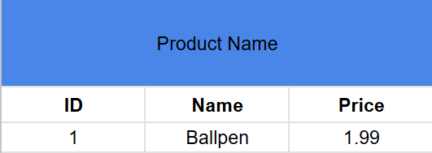

# SQL DATABASE

Things you'll be doing alot.

**CRUD** or Create, Read, Update, Destroy.

Place to test database.
*[cysql.com](https://dtvkuro.github.io/Pronote/cysql/)*

## A. CREATE



```
CREATE TABLE products 
(
  id int NOT NULL, /*RT A1*/
  name string,
  price money, /*RT A2*/
  
  PRIMARY KEY(id) /*RT A3*/ 
);
```
### A1 CONSTRAINT
This is like a requirement.
NOT NULL means that a table or a row will not be created without ID,
Especially Primary Key because its important to find an item.

*TIP: Making it **PRIMARY KEY** automatically means its **NOT NULL** so Pkey with NOT NULL is redundant.*

I only put the NOT NULL there to explain it.

### A2 Datatypes
SQL has their own datatypes that are used within it.
like string, int, money, littlemoney, char, and many more

to learn more: *https://www.w3schools.com/sql/sql_datatypes.asp*
### A3 Unique Key
This gives all table a unique ID only for that specific product.
And theres 2 way to make a ID column as primary key.

SOLO KEY `id int PRIMARY KEY`
MULTIPLE `PRIMARY KEY(id, name)`

---

### INSERTING INTO THE DATABASE TABLE

FOR SPECIFIC INSERTING
`INSERT INTO products (id, name, price)`
`VALUES(1, 'Ballpen', 1.99)`

FOR ALL INSERT
```
INSERT INTO products 
VALUES(1, 'Ballpen', 1.99)
```

This will add a column into the Table.

---

## B. READ

Most common keywoard to read is `SELECT`

Show the whole table:
`SELECT * FROM 'products';`

Show whole table with custom column :
`SELECT name, price FROM 'products';`
*This will still show all products but with only the Name and Price as the column, no ID.*

Show a specific row in the Database:
`SELECT * FROM 'products' WHERE id=1;`
This will show only the row with ID of 1 in the products table.

---

## C. UPDATE  

```
UPDATE products
SET price = 0.80
WHERE id = 2;
```

**UPDATE** means to change info on the products table,
**SET** is the column and the value you set it as,
**WHERE** is the location you will set the value, if you dont put that. It will make all value as 0.80

### C1. ALTER TABLE
And if you wanna add another column in the table.
you can do Alter.

```
ALTER TABLE products
ADD stock int;
```

---

## D. DELETE  

```
DELETE FROM products
WHERE id = 2
```

its a pretty easy process, where you just need the DELETE FROM which tells what table you are deleting from
then the WHERE which you put so it knows what id row it will delete.

## E. RELATIONSHIPS ON SQL

As i said before you can make relations on tables so how do we do it?

It is through **Foreign Key**. Which is used to link two tables together.
*go here to learn more: https://www.w3schools.com/sql/sql_foreignkey.ASP*

since we already have the products table we will need to create a orders table for ordering.

```
CREATE TABLE orders
(
  id INT NOT NULL,
  order_number INT,
  customer_id INT,
  product_id INT,

  PRIMARY KEY(id),
  FOREIGN KEY (customer_id) REFERENCES customers(id), /* RT E1*/ 
  FOREIGN KEY (product_id) REFERENCES products(id),
);
```
### E1. Foreign Key and REFERENCES

As i said **Foreign Key** is a *link*.
  - **FOREIGN KEY** (customer_id) is the column in this table that does the linking.
  - **REFERENCES** customers(id) is where it links to the `id` column in the customers table.

 So `customer_id` in orders table = `id` in customers table.

**IMPORTANT:** Foreign Key only creates the link (and blocks invalid ids). To actually combine the data when reading, use JOIN.
 
 ### E2. JOINT  

 ```
 SELECT orders.order_number, customers.first_name, customers.last_name, customers.address, products.name
 FROM orders
INNER JOIN customers ON orders.customer_id = customer_id
INNER JOIN products ON orders.product_id = product_id;
 ```

