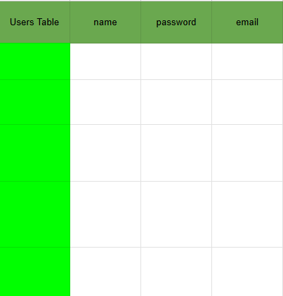

# DATABASE

## Data Persistence

Data Storage is needed so the data in temporary storage dont get wipe when server restart.

### Types of Databases

**Structured Query Language (SQL)**


*Allows user to query to access a data.*

Structurally, the data is stored in a table like this.

This Database is also known as *Relational DB*,

Because for example we make another table for Posts, and one post takes up one row, you can connect that row to the Users table. to the user that posted it. Connecting the post into a user rather than clustering a code to the user for the posts.

Examples of SQL DB's:
ORACLE (worldwide most used but costs money)
PostgreSQL
MySQL
SQLite
etc.

Some of these are **open-sourced** like *Postgres, SQLite, etc.* 

**NoSQL**

Its a Database that doesnt have a structure. And its still used because of its **Flexibility**.

For example:

This is the standard structure:
```
user: {
  name: "Angela",
  email: random@email.com,
  password: 123,
}
```

But you can customize a specific user's field even if the field doesnt exist.
So for example you wanna add favorite food to a user.
```
user: {
  name: "Angela",
  email: random@email.com,
  password: 123,
  favfood: "hotdog"
}
```
This new structure does not affect the original structure, which is why its flexible cause its customizable.

NoSQL DB was created because of SQL pain.

SQL requires learning
Flexibility
Scalability on **Horizontally** (having more fields) and **Vertically** (having more records)

examples of NoSQL DB:

MongoDB
RedisDB
DynamoDB
etc.

SQL is considered traditionaal and NoSQL as new and modern.
But lately people sees that NoSQL is not as cool as it seems.

SQL is better in **Relationship**, **Structure**

